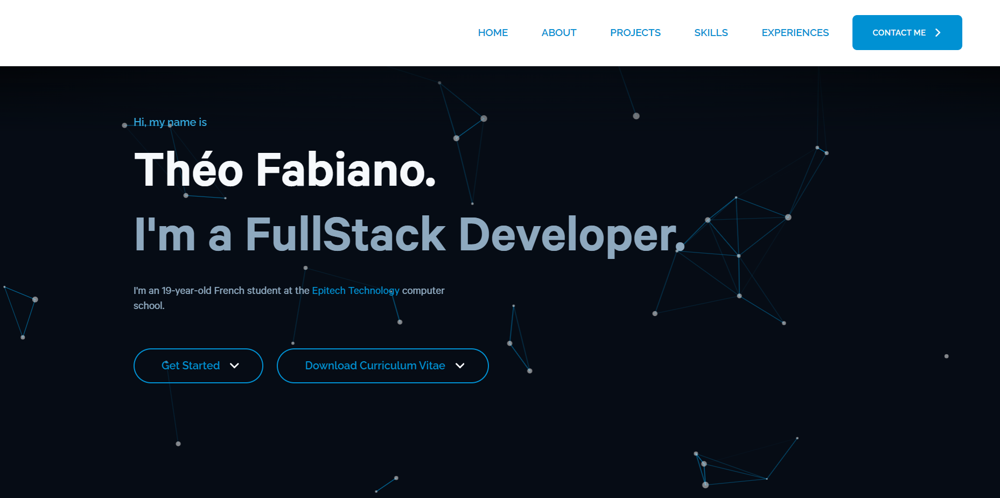

# Portfolio

Welcome to my portfolio! This project was created to showcase my skills, projects, and professional experiences. It was developed using React and TypeScript.

## Access

- The website is online at the address : **[theofabiano.me](https://theofabiano.me/)**.

## Features

- Display information about myself, my skills, and my projects.
- Showcase my achievements with screenshots and descriptions.
- Contact form for reaching out to me.
- Responsive design for optimal user experience across devices.

## Technologies Used

- React
- TypeScript
- HTML5
- CSS3

## Installation

1. Clone this repository to your local machine.
2. Ensure you have Node.js and npm installed.
3. Run the command `npm install` to install the dependencies.
4. Run the command `npm start` to start the application in development mode.
5. Access **<http://localhost:3000>** in your browser to see the portfolio in action.

## Contribution

Contributions are welcome! If you'd like to improve this project, feel free to submit a pull request.

## Contact

If you have any questions or comments, feel free to contact me. You can find my contact details on my portfolio at **[theofabiano.me](https://theofabiano.me/)**.
